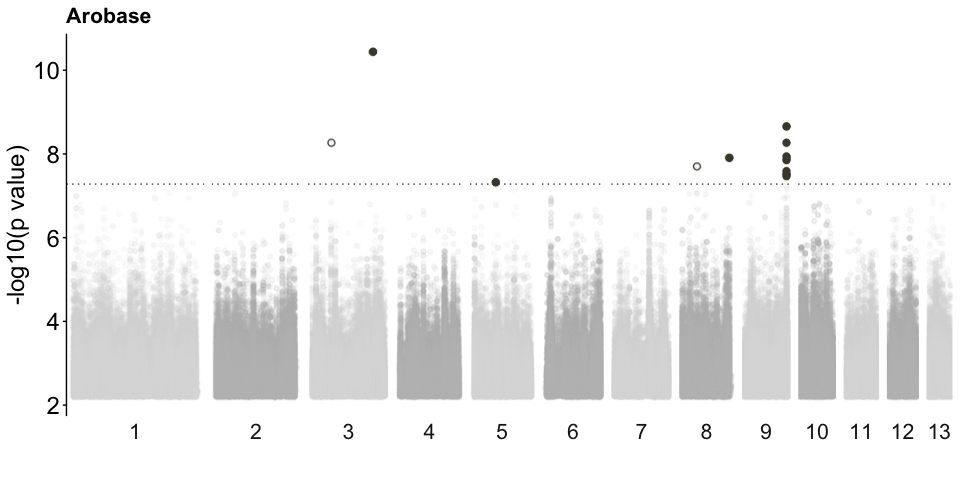

GHA Z. tritici – Visualization & Bootstrapping Workflow
================
Cécile Lorrain et al.

- [0.1 Genome-host association subsampling
  matrix](#01-genome-host-association-subsampling-matrix)
  - [0.1.1 Step 1: Prepare metadata](#011-step-1-prepare-metadata)
  - [0.1.2 Step 2: Generate 100 bootstrap phenotype
    tables](#012-step-2-generate-100-bootstrap-phenotype-tables)
  - [0.1.3 Step 3: Export per-cultivar / per-bootstrap CSV
    files](#013-step-3-export-per-cultivar--per-bootstrap-csv-files)

<style>
body {
text-align: justify}
</style>

## 0.1 Genome-host association subsampling matrix

### 0.1.1 Step 1: Prepare metadata

``` r
library(dplyr)
library(plyr)
library(tidyr)
library(scales)
library(ggpubr)
library(forcats)
library(ggplot2)
library(gridExtra)
library(vegan)
library(RColorBrewer)
library(car)
library(knitr)
library(gggenes)
library(tidyverse)
library(RColorBrewer)
library(data.table)
library("magrittr")
library("kableExtra")
library(plotly)
library(devtools)
library(viridis)
library(ggnewscale)
library(ggrepel)
library(CMplot)
library(tidyverse)
library(dplyr)
palette12colors <- c("grey","#4A4737","#2B4418", "#7F7844","#B8AE37", "#C4A458", "#FFD28C", "#b45248", "#d48c84","#643c6a", "#836394", "black")
palette13colors <- c("grey","#4A4737","#2B4418", "#7F7844","#B8AE37", "#C4A458", "#FFD28C", "#b45248", "#d48c84","#643c6a", "#836394", "black")
library(tidyverse)

#
#paper metadata
paper_metadata <- read.csv("~/Desktop/PROJECTS/2_Host_GWAS/Host_SNP_GWAS/1_Storyline_genomics_paper/6_submission/Lorrain_et_al_GWAS/REVISIONS_NATPLANTS/revisions/working_stuff/Supplementary_data_1.csv", header = T)
paper_metadata <- paper_metadata %>% 
  filter(Final.genomic.dataset == "YES")
matrix_host_phenotypes <- paper_metadata[,c(1,3)]
matrix_host_phenotypes$Wheat.Cultivar = as.factor(matrix_host_phenotypes$Wheat.Cultivar) 
```

``` r
# Count the number of samples for each cultivar
#cultivar_counts <- table(matrix_host_phenotypes$Wheat.Cultivar)
#print(cultivar_counts)
# Example metadata table
cultivar_counts <- data.frame(
  Wheat.Cultivar = c("ARINA", "AROBASE", "AUBUSSON", "CH CAMEDO", "CH CLARO", 
                     "CH COMBIN", "FOREL", "LORENZO", "RUNAL", "SIMANO", 
                     "TITLIS", "ZINAL"),
  num_samples = c(55, 65, 82, 67, 97, 28, 72, 82, 92, 55, 54, 82),
  subsample_size = c(55, 65, 82, 67, 97, 28, 72, 82, 92, 55, 54, 82)
)

total_samples <- 832  # Total number of samples across all cultivars
print(cultivar_counts)
```

    ##    Wheat.Cultivar num_samples subsample_size
    ## 1           ARINA          55             55
    ## 2         AROBASE          65             65
    ## 3        AUBUSSON          82             82
    ## 4       CH CAMEDO          67             67
    ## 5        CH CLARO          97             97
    ## 6       CH COMBIN          28             28
    ## 7           FOREL          72             72
    ## 8         LORENZO          82             82
    ## 9           RUNAL          92             92
    ## 10         SIMANO          55             55
    ## 11         TITLIS          54             54
    ## 12          ZINAL          82             82

### 0.1.2 Step 2: Generate 100 bootstrap phenotype tables

``` r
library(dplyr)
library(tidyr)

# Number of bootstraps (fixed)
n_boot <- 100
set.seed(123)  # reproducibility for all bootstraps

# Cultivar sample sizes (test group size = subsample size)
subsample_size_CL <- c(
  "ARINA" = 55,
  "AROBASE" = 65,
  "AUBUSSON" = 82,
  "CH CAMEDO" = 67,
  "CH CLARO" = 97,
  "CH COMBIN" = 28,
  "FOREL" = 72,
  "LORENZO" = 82,
  "RUNAL" = 92,
  "SIMANO" = 55,
  "TITLIS" = 54,
  "ZINAL" = 82
)

cultivars <- names(subsample_size_CL)

# Store outputs
matrix_list <- list()

for (cultivar in cultivars) {

  # Test group
  specific_cultivar <- matrix_host_phenotypes %>%
    filter(Wheat.Cultivar == cultivar) %>%
    mutate(Flag = 1, Bootstrap = "TEST")

  # Control pool: all other cultivars
  tmp_sub <- matrix_host_phenotypes %>%
    filter(Wheat.Cultivar != cultivar)

  X <- tmp_sub$Isolate.ID
  subsample_size <- subsample_size_CL[[cultivar]]

  if (length(X) < subsample_size) {
    stop(sprintf("Not enough control isolates for cultivar %s: need %d, have %d",
                 cultivar, subsample_size, length(X)))
  }

  # Draw 100 bootstrap control samples (columns = B1..B100)
  rand_df <- as.data.frame(
    lapply(seq_len(n_boot), function(i) sample(X, size = subsample_size, replace = FALSE))
  )
  names(rand_df) <- paste0("B", seq_len(n_boot))

  # Long format: one row per control isolate per bootstrap
  controls_long <- rand_df %>%
    pivot_longer(cols = everything(), names_to = "Bootstrap", values_to = "Isolate.ID") %>%
    mutate(Flag = 0)

  # Combine test + controls
  combined_data <- bind_rows(
    specific_cultivar,
    controls_long
  )

  matrix_list[[cultivar]] <- combined_data
}

# Example: access one cultivar
matrix_AROBASE_subsampling <- matrix_list[["AROBASE"]]

# To access the matrix for each cultivar
#matrix_ARINA_subsampling <- matrix_list[["ARINA"]]
#matrix_AROBASE_subsampling <- matrix_list[["AROBASE"]]
#matrix_AUBUSSON_subsampling <- matrix_list[["AUBUSSON"]]
#matrix_CAMEDO_subsampling <- matrix_list[["CH CAMEDO"]]
#matrix_CLARO_subsampling <- matrix_list[["CH CLARO"]]
#matrix_COMBIN_subsampling <- matrix_list[["CH COMBIN"]]
#matrix_FOREL_subsampling <- matrix_list[["FOREL"]]
#matrix_LORENZO_subsampling <- matrix_list[["LORENZO"]]
#matrix_RUNAL_subsampling <- matrix_list[["RUNAL"]]
#matrix_SIMANO_subsampling <- matrix_list[["SIMANO"]]
#matrix_TITLIS_subsampling <- matrix_list[["TITLIS"]]
#matrix_ZINAL_subsampling <- matrix_list[["ZINAL"]]
```

### 0.1.3 Step 3: Export per-cultivar / per-bootstrap CSV files

``` r
library(dplyr)

# Function to filter data for a given cultivar and all Vn levels
filter_cultivar_data <- function(df, cultivar) {
  # Extract unique Vn levels from the column
  v_levels <- grep("^V", levels(df$Wheat.Cultivar), value = TRUE)
  
  # Initialize a list to store results
  result_list <- list()
  
  # Filter the cultivar and each Vn level
  for (v in v_levels) {
    result_list[[v]] <- df %>%
      filter(Wheat.Cultivar == cultivar | Wheat.Cultivar == v)
  }
  
  return(result_list)
}

# List of cultivars
cultivars <- c("ARINA", "AROBASE", "AUBUSSON", "CH CAMEDO", "CH CLARO", 
               "CH COMBIN", "FOREL", "LORENZO", "RUNAL", "SIMANO", 
               "TITLIS", "ZINAL")

# Initialize a list to store the filtered data frames
filtered_data_list <- list()

# Directory to save the CSV files
output_dir <- "~/Desktop/PROJECTS/2_Host_GWAS/Host_SNP_GWAS/1_Storyline_genomics_paper/6_submission/Lorrain_et_al_GWAS/REVISIONS_NATPLANTS/revisions/subsampling_gwas/"

# Process each cultivar
for (cultivar in cultivars) {
  # Get the matrix for the current cultivar
  matrix_subsampling <- matrix_list[[cultivar]]
  
  # Apply the filtering function
  filtered_data_list[[cultivar]] <- filter_cultivar_data(matrix_subsampling, cultivar)
  
  # Export each filtered data frame to a CSV file
  for (v in names(filtered_data_list[[cultivar]])) {
    df_to_export <- filtered_data_list[[cultivar]][[v]]
    filename <- paste0(output_dir, cultivar, "_", v, ".csv")
    write.csv(df_to_export, file = filename, row.names = FALSE)
  }
}

# Example message to confirm export
cat("Data frames have been exported to CSV files.\n")
```

#### 0.1.3.1 Step 5: GHA visualization example

#### 0.1.3.2 Step 5.1: Load and prepare tables

``` r
## SNPEff, variants of interests
## bestSNPs
voi <- read.delim("~/Desktop/PROJECTS/2_Host_GWAS/Host_SNP_GWAS/8_host_gwas/5_variants_of_interest/snpeff_analysis/Zymoseptoria_tritici_IPO323_most_impactful_eshikon.tsv", header = F, sep = "\t", na.strings = "")
names(voi) = c("chr", "ps", "ref", "alt", "score", "effect", "target_type","target", "ANN")
annotations <- read.delim("~/Desktop/PROJECTS/3_Ivona_thesis/2_Evolvability/0_raw_data_parental_strains_genomes/IPO323/Lapalu_annotation2023/z.tritici.IPO323.annotations.txt", header = T, sep = "\t", na.strings = "")

### grouped plot with 1% of SNPs
Varobase <- read.csv("~/Desktop/PROJECTS/2_Host_GWAS/Host_SNP_GWAS/8_host_gwas/2_subsampling_gwas/arobase/arobase2_top1perc/summarized_top1perc_SNPs_complete_arobase_filtered.csv", header = T, sep = "\t")
Varobase <- Varobase[,c(-14)]
names(Varobase)[names(Varobase) == 'V100'] <- 'Subsampling'

thresholdArobase = 0.05/951427

Varobase1 <- Varobase %>% 
  dplyr::group_by(chr) %>% 
  dplyr::summarise(chr_len = max(ps), .groups = "drop") %>% 
  dplyr::mutate(tot = cumsum(chr_len) - chr_len) %>% 
  dplyr::select(chr, tot) %>% 
  dplyr::left_join(Varobase, ., by = "chr") %>% 
  dplyr::arrange(chr, ps) %>% 
  dplyr::mutate(BPcum = ps + tot)

Varobase1 <- Varobase1 %>% 
  # Add highlight and annotation information
  mutate( is_highlight=ifelse(-log10(p_wald)>thresholdArobase, "yes", "no")) %>% filter(chr < 14)

customHighlight <- Varobase1 %>%
  filter(is_highlight == "yes") %>%
  group_by(chr)

axisdf <- Varobase1 %>% 
  group_by(chr) %>% 
  filter(chr < 14) %>%
  summarise(center=(min(BPcum)+max(BPcum))/2) 
axisdf2 <- axisdf %>% 
  summarise((size = center*2))
```

#### 0.1.3.3 Step 5.2: Highlight best SNPs

``` r
#arobase
arobase_peak <- Varobase1%>%filter(p_wald < thresholdArobase)%>%filter(chr < 14)
arobase_peak <- left_join(arobase_peak, voi)
arobase_peak <- left_join(arobase_peak, annotations)
arobase_peak$HOST <- "AROBASE"

arobase_best <- arobase_peak %>% group_by(chr, gene,MPI_genes, start,end, HOST) %>% tally() %>%filter(n>1)
arobase_best2 <- left_join(arobase_best, arobase_peak)
```

#### 0.1.3.4 Step 5.3: Mahhattan plot Arobase

``` r
ggplot(Varobase1 %>% filter(chr < 14), aes(x = BPcum, y = -log10(p_wald))) +
  # Rasterize the background layer (millions of SNPs)
  ggrastr::geom_point_rast(aes(color = as.factor(chr)), size = 1.3, alpha = 0.1, dpi = 300) +
  geom_hline(yintercept = -log10(thresholdArobase), color = "grey30", linetype = 'dotted') +
  scale_color_manual(values = rep(c("grey85", "grey75"), 22)) +
  scale_x_continuous(labels = axisdf$chr, breaks = axisdf$center) +
  new_scale_colour() +
  # Layer 2: highlighted SNPs — also rasterized
  ggrastr::geom_point_rast(data = subset(Varobase1 %>% filter(p_wald < thresholdArobase), is_highlight == "yes"),
                           shape = 1, size = 2, aes(color = as.factor(chr)), dpi = 300) +
  scale_color_manual(values = rep(palette13colors[c(2)], 22)) +
  new_scale_colour() +
  # Layer 3: top candidates — you can keep these as vector if few
  geom_point(data = subset(arobase_best2 %>% filter(p_wald < thresholdArobase), is_highlight == "yes"),
             size = 2, aes(color = as.factor(chr))) +
  scale_color_manual(values = rep(palette13colors[c(2)], 22)) +
  theme_classic() +
  xlab("") +
  ylab("-log10(p value)") +
  theme(
    legend.position = "none",
    panel.border = element_blank(),
    panel.grid.major.x = element_blank(),
    panel.grid.minor.x = element_blank(),
    axis.text.x = element_blank(),
    axis.title = element_text(size = 18),
    axis.text.y = element_text(size = 18),
    axis.ticks.x = element_blank(),
    axis.line.x = element_blank(),
    strip.background = element_rect(color = "white", fill = "white"),
    strip.text.x = element_text(size = 16),
    plot.title = element_text(size = 16, face = "bold")
  ) +
  facet_grid(cols = vars(chr), scales = "free_x", space = "free_x", switch = "both") +
  ggtitle("Arobase")
```


